# Codex 文档索引

> 更新时间：2025-12-15 14:56:36
>
本文档目录提供了 Codex 项目的完整文档索引和快速导航。

## 文档分类

### 🚀 入门指南
- [Getting Started](getting-started.md) - 快速开始使用 Codex
- [Installation](install.md) - 安装指南
- [FAQ](faq.md) - 常见问题解答

### ⚙️ 配置和定制
- [Configuration](config.md) - 配置选项详解
- [Example Configuration](example-config.md) - 配置示例
- [Authentication](authentication.md) - 认证设置

### 🔧 功能和特性
- [Exec Commands](exec.md) - 命令执行功能
- [Execution Policy](execpolicy.md) - 执行策略配置
- [Skills](skills.md) - 技能系统使用
- [Experimental Features](experimental.md) - 实验性功能

### 🛡️ 安全和沙箱
- [Sandboxing](sandbox.md) - 沙箱机制概述
- [Platform Sandboxing](platform-sandboxing.md) - 平台特定沙箱实现
- [Windows Sandbox Security](windows_sandbox_security.md) - Windows 沙箱安全

### 🤖 高级功能
- [Agents](agents_md.md) - AI 代理系统
- [ZDR](zdr.md) - Zero Delay Responses 系统
- [Slash Commands](slash_commands.md) - 斜杠命令参考
- [Prompts](prompts.md) - 提示工程指南

### 🏗️ 开发者指南
- [Contributing](contributing.md) - 贡献指南
- [Advanced Usage](advanced.md) - 高级使用技巧

### 📄 法律和许可
- [CLA](CLA.md) - 贡献者许可协议
- [License](license.md) - 许可证信息
- [Open Source Fund](open-source-fund.md) - 开源基金

## 文档导航图

```mermaid
graph TD
    A[Codex 文档] --> B[入门]
    A --> C[配置]
    A --> D[功能]
    A --> E[安全]
    A --> F[高级]
    A --> G[开发]
    A --> H[法律]

    B --> B1[Getting Started]
    B --> B2[Installation]
    B --> B3[FAQ]

    C --> C1[Configuration]
    C --> C2[Example Config]
    C --> C3[Authentication]

    D --> D1[Exec]
    D --> D2[ExecPolicy]
    D --> D3[Skills]
    D --> D4[Experimental]

    E --> E1[Sandboxing]
    E --> E2[Platform Sandboxing]
    E --> E3[Windows Security]

    F --> F1[Agents]
    F --> F2[ZDR]
    F --> F3[Slash Commands]
    F --> F4[Prompts]

    G --> G1[Contributing]
    G --> G2[Advanced]

    H --> H1[CLA]
    H --> H2[License]
    H --> H3[Open Source Fund]
```



## 快速开始

1. **新手用户路径**：
   - [Installation](install.md) → [Getting Started](getting-started.md) → [FAQ](faq.md)

2. **配置路径**：
   - [Configuration](config.md) → [Example Configuration](example-config.md) → [Authentication](authentication.md)

3. **高级用户路径**：
   - [Advanced Usage](advanced.md) → [Exec](exec.md) → [Experimental Features](experimental.md)

4. **安全关注路径**：
   - [Sandboxing](sandbox.md) → [Platform Sandboxing](platform-sandboxing.md) → [Windows Sandbox Security](windows_sandbox_security.md)

5. **开发者路径**：
   - [Contributing](contributing.md) → [CLA](CLA.md) → [Advanced Usage](advanced.md)

## 文档贡献

### 文档结构
- 使用 Markdown 格式
- 遵循统一的标题层级
- 包含代码示例和使用案例
- 添加适当的 mermaid 图表

### 代码示例
所有代码示例应该：
- 包含完整的上下文
- 使用正确的语法高亮
- 包含必要的注释
- 经过验证可以运行

```rust
// 示例：创建新线程
use codex_sdk::Codex;

let codex = Codex::new();
let thread = codex.start_thread();
let response = thread.run("Hello, Codex!").await?;
```

## 术语表

| 术语 | 定义 |
|------|------|
| MCP | Model Context Protocol - 模型上下文协议 |
| TUI | Terminal User Interface - 终端用户界面 |
| ExecPolicy | 执行策略 - 控制命令执行的规则 |
| ZDR | Zero Delay Response - 零延迟响应系统 |
| Skills | 技能 - 可加载的功能模块 |

## 相关资源

### 官方文档
- [Codex GitHub](https://github.com/openai/codex)
- [API 参考](https://api.codex.ai)
- [示例仓库](https://github.com/codex-examples)

### 社区资源
- [Discord 社区](https://discord.gg/codex)
- [讨论论坛](https://discuss.codex.ai)
- [Stack Overflow](https://stackoverflow.com/questions/tagged/codex)

### 开发资源
- [SDK 文档](../sdk/typescript/README.md)
- [MCP 服务器文档](../shell-tool-mcp/README.md)
- [测试策略](../TESTING.md)

## 反馈和建议

如果您发现文档问题或有改进建议，请：

1. 在 GitHub 上提交 Issue
2. 发起 Pull Request
3. 参与社区讨论

## 文档版本控制

本文档与代码版本同步更新：
- 主要版本更新：重大功能变更
- 次要版本更新：新功能和改进
- 补丁版本更新：错误修复和小改进

最后更新：2025-12-15 14:56:36